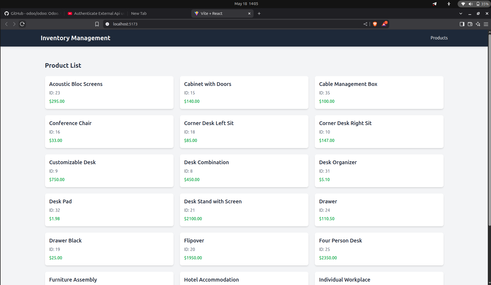

# Inventory Management Frontend

A React-based frontend application for managing product inventory. This application communicates with an Odoo backend API to display product information.



## Features

- Product listing with details (name, ID, price)
- Responsive grid layout using Tailwind CSS
- State management with Redux
- API data fetching and caching with React Query
- HTTP requests with Axios

## Tech Stack

- React (via Vite)
- Tailwind CSS for styling
- Redux for state management
- React Query for data fetching and caching
- Axios for API requests

## Prerequisites

- Node.js (v14 or later)
- npm or yarn
- Access to the Odoo backend API

## Environment Variables

Create a `.env` file in the root directory with the following variables:

```
VITE_BASE_URL=http://localhost:8069/api/v1
VITE_API_TOKEN=your_api_token_here
```

## Installation

1. Clone the repository
2. Install dependencies:

```bash
npm install
```

3. Start the development server:

```bash
npm run dev
```

## API Integration

The application connects to an Odoo backend API at the specified URL. Make sure the API server is running and accessible. The API should provide product information in the following format:

```json
{
  "data": [
    { "id": 23, "name": "Acoustic Bloc Screens", "list_price": 295.0 },
    { "id": 15, "name": "Cabinet with Doors", "list_price": 140.0 }
  ]
}
```

## CORS Configuration

If you encounter CORS issues, you have two options:

1. Configure the backend to allow CORS (recommended)
2. Use the Vite proxy configuration (already set up in `vite.config.js`)

## Building for Production

To build the application for production:

```bash
npm run build
```

The built files will be in the `dist` directory.
